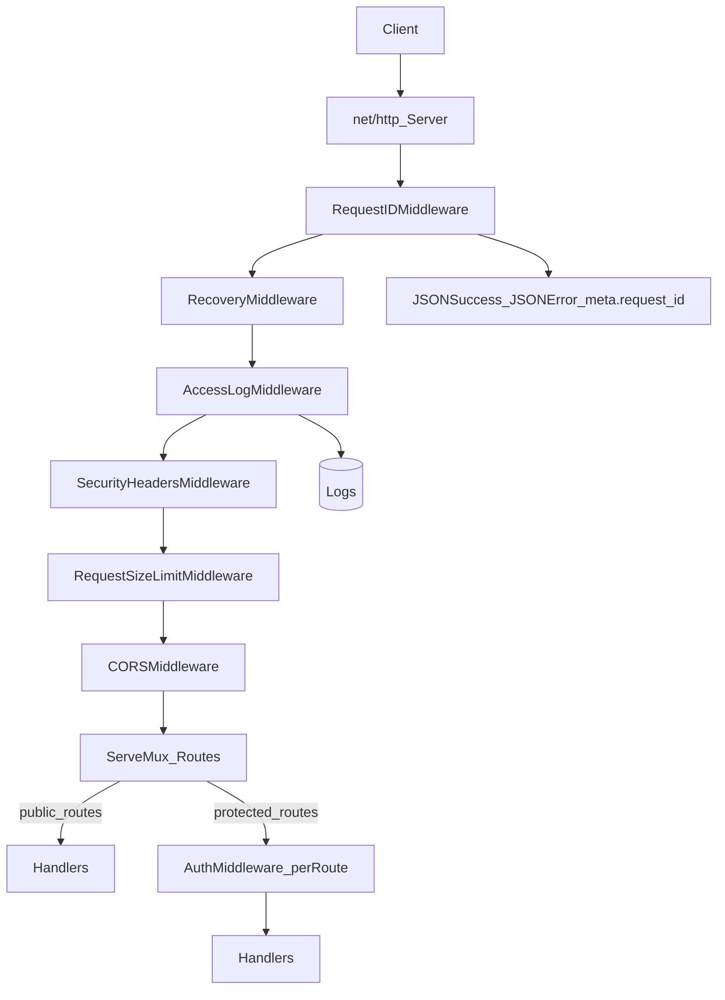

## Context (what you have today)

- RFC phase-2 explicitly calls out baseline observability + hardening (request IDs, access logs, panic recovery, graceful shutdown, and HTTP hardening) in `docs/rfc/phase-2.md` (see **Security & Observability** section around L190–L201).
- The API is currently wired in `cmd/api/main.go` with:
  - Per-route auth via `httpx.AuthMiddleware(...)`
  - Global middlewares already in place: `SecurityHeadersMiddleware`, `RequestSizeLimitMiddleware`, `CORSMiddleware` (see main around L196–L201)
  - HTTP timeouts set, but missing `ReadHeaderTimeout` + `MaxHeaderBytes` (RFC wants those)
  - No graceful shutdown (SIGTERM/SIGINT)
  - No request ID / recovery / access logs yet

## What “simple observability + security” means (scope)

- **Observability** (RFC-aligned, no full OpenTelemetry):
  - Request ID propagation (`X-Request-Id`) + included in JSON response `meta`
  - Panic recovery middleware returning a clean JSON 500 including request id
  - Access logs with `method`, `path`, `status`, `duration_ms`, `request_id`, `user_id`
  - Optional “basic metrics” endpoint (`/metrics`) for Prometheus (minimal setup)

- **Security** (baseline hardening, minimal moving parts):
  - HTTP server hardening (`ReadHeaderTimeout`, `MaxHeaderBytes`)
  - Rate limiting for sensitive endpoints (login/register/refresh/internal jobs)
  - Ensure auth failures use consistent JSON errors (avoid plain `http.Error`)

## User stories

### Operator / SRE

- As an **Operator**, I want every request to include a **Request ID** in logs and error responses so I can trace production incidents quickly.
- As an **Operator**, I want **panic recovery** so a single bad request doesn’t crash the process.
- As an **Operator**, I want **graceful shutdown** so deploys don’t drop in-flight requests.
- As an **Operator**, I want **basic metrics** so I can alert on error rate and latency.

### Security / API Owner

- As an **API Owner**, I want **rate limiting** on auth and internal job endpoints to reduce brute-force and abuse risk.
- As an **API Owner**, I want consistent **JSON error responses** so clients can reliably handle failures.

### Developer

- As a **Developer**, I want a consistent `meta.request_id` in success/error JSON so debugging is easier locally and in CI logs.

## Diagram (request lifecycle with new middleware)

## Implementation notes (where changes will go)

- Add new middleware to `internal/httpx/` (keep feature handlers thin; match existing approach).
- Integrate the new middleware chain in `cmd/api/main.go` alongside the existing `httpx.SecurityHeadersMiddleware`, `httpx.RequestSizeLimitMiddleware`, and `httpx.CORSMiddleware`.
- Keep it incremental: no routing refactors required, no distributed tracing.

## Acceptance criteria (done means)

- Every HTTP response includes `X-Request-Id`.
- Every JSON response includes `meta.request_id` (both success and error).
- Panics become JSON 500 with `request_id` and do not crash the server.
- Access logs exist for every request with status + duration.
- SIGTERM triggers graceful shutdown.
- Sensitive endpoints are rate limited.
- (Optional) `/metrics` endpoint exposes basic Prometheus metrics.