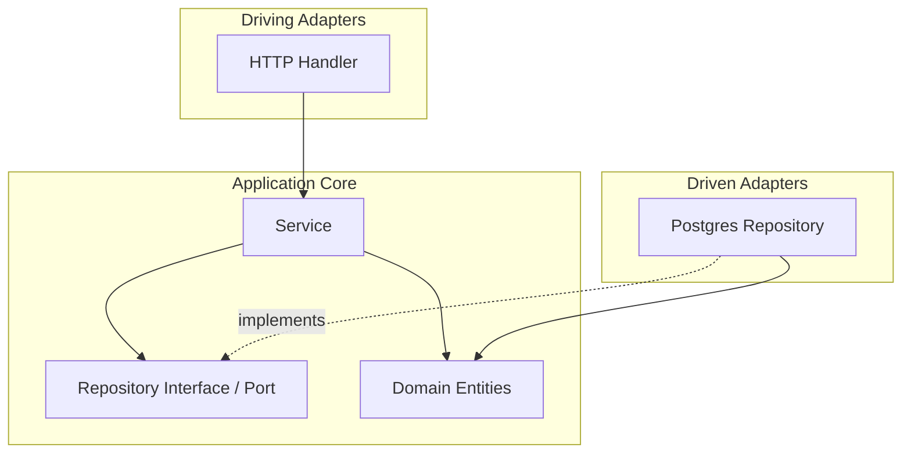
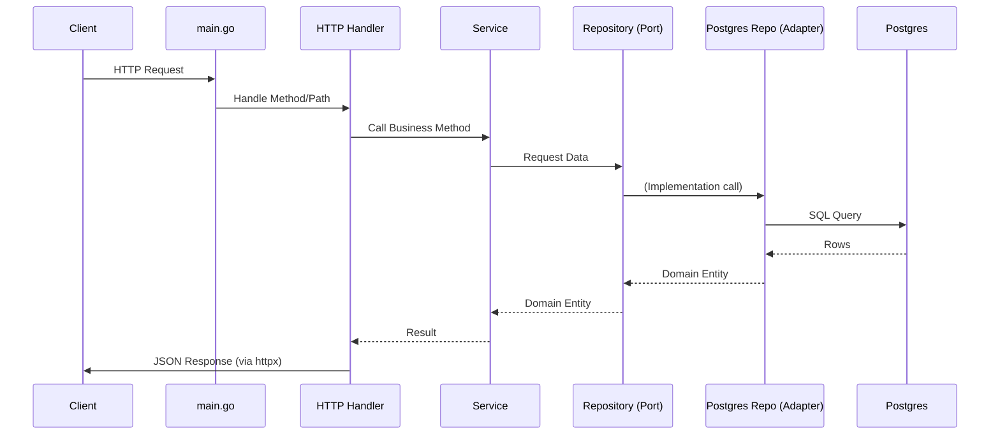

# Architecture Documentation

This document describes the architectural patterns and folder structure used in the `bookapi` project.

## Architecture Style: Feature-Based Clean Architecture (Screaming Architecture)

The project follows a **Feature-Based Clean Architecture**, also known as **Screaming Architecture**. Instead of grouping code by technical layers (e.g., `controllers/`, `services/`, `models/`), code is grouped by business capabilities (e.g., `book/`, `user/`, `auth/`).

### Key Benefits
- **Maintainability**: Each feature has a single "home". Developers don't have to jump between 4-5 top-level folders to make a change.
- **Readability**: The folder structure "screams" what the application does.
- **Decoupling**: Features are isolated, making it easier to test and eventually split into microservices if needed.
- **Ports & Adapters**: Each module uses the Hexagonal (Ports & Adapters) pattern to keep business logic independent of external technologies (like Postgres or HTTP).

---

## Folder Structure

```text
internal/
├── <feature>/           # Feature Modules (e.g., book, user, auth)
│   ├── <feature>.go     # Domain entities and module-specific types
│   ├── ports.go         # Interfaces (Ports) owned by the module (e.g., Repository)
│   ├── service.go       # Application layer: Business logic
│   ├── http_handler.go  # Primary Adapter: HTTP interface
│   └── postgres_repo.go # Secondary Adapter: Postgres persistence
├── httpx/               # Shared HTTP Kit (JSON responses, middleware, validator)
└── platform/            # Infrastructure & External Tools
    └── crypto/          # JWT and Password helpers
```

---

## Dependency Direction

The core principle is that **dependencies point inward**. Business logic (Service) should not know about HTTP or SQL specifics.



---

## Request Flow

A typical request follows this path:

1.  **Entry**: `cmd/api/main.go` routes the request to the module's `HTTPHandler`.
2.  **Adapter (In)**: `HTTPHandler` decodes the request, validates input using `httpx`, and calls the `Service`.
3.  **Application**: `Service` executes business rules. If data is needed, it calls a `Port` (Interface).
4.  **Adapter (Out)**: `PostgresRepo` (which implements the `Port`) executes SQL and returns domain entities.
5.  **Exit**: `Service` returns results to `HTTPHandler`, which uses `httpx` to send a JSON response.



---

## Shared Packages

-   **`internal/httpx`**: Contains reusable helpers for standardizing API responses, handling authentication middleware, and input validation. This keeps module handlers thin.
-   **`internal/platform/crypto`**: Provides JWT signing/parsing and password hashing. This is considered infrastructure and is decoupled from the business services.
