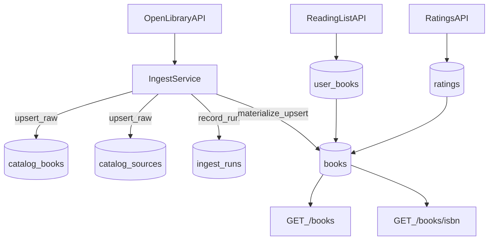
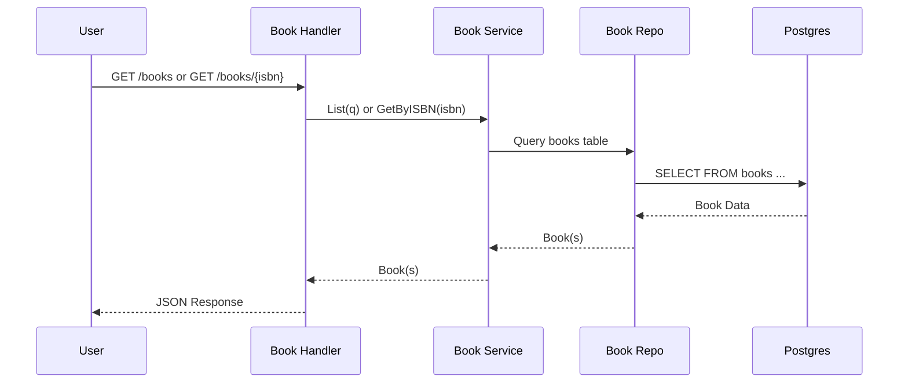

# RFC: Personal Book Tracking API

Unified specification for the Book Tracking API, combining core API design, implementation phases, and production readiness.

---

# Part I: Core API

## 1. Motivation

A REST API to help users track books they've read, want to read, or are currently reading. Inspired by Goodreads, but lightweight and personal.

---

## 2. Resources

- **Users**: register, login, manage their personal lists.
- **Books**: metadata available publicly (ISBN, title, description, genre, publisher).
- **Wishlists / Reading Lists / Ratings**: private to each user.

---

## 3. Endpoints

### Public

- `POST /users/register` → create new user.
- `POST /users/login` → authenticate, return JWT token.
- `GET /books` → list all books (with pagination + filters: `genre`, `publisher`).
- `GET /books/{isbn}` → get details of a single book.

### Private (requires login)

- `POST /users/{id}/wishlist` → add a book to wishlist.
- `GET /users/{id}/wishlist` → view wishlist.
- `POST /users/{id}/reading` → mark a book as currently reading.
- `GET /users/{id}/reading` → list books currently being read.
- `POST /users/{id}/finished` → mark a book as finished.
- `GET /users/{id}/finished` → list finished books.
- `POST /books/{isbn}/rating` → rate a book (1–5 stars).
- `GET /books/{isbn}/rating` → see average rating + your rating.

---

## 4. Status Codes & Rules

- `200 OK` → success GET.
- `201 Created` → new resource added (register, add to wishlist).
- `400 Bad Request` → invalid input (missing title, bad rating).
- `401 Unauthorized` → not logged in for private endpoints.
- `404 Not Found` → book or user doesn't exist.

Validation:

- Rating must be between 1–5.
- ISBN must be valid format.
- User must exist before adding wishlist.

---

## 5. User Stories

*As a user…*

1. **Registration & Login**
   - I can create an account with email/password.
   - I can log in and receive a token to use for other endpoints.
2. **Browse Books**
   - I can see all books without logging in.
   - I can search/filter books by genre or publisher.
   - I can open a single book's detail page.
3. **Wishlist & Reading Progress**
   - I can add books I want to read into my wishlist.
   - I can move a book from wishlist → currently reading.
   - I can mark a book as finished and see my finished list.
4. **Rating**
   - I can give a star rating (1–5) to a book I've finished.
   - I can see the average rating of any book, and my own rating if logged in.

---

# Part II: Data Model

## 6. DBML Schema

```sql
Project BookLibrary {
  database_type: 'Postgres'
  Note: 'Schema for Book Tracking API (Users, Books, UserBooks, Ratings)'
}

Table users {
  id uuid [pk]
  username varchar [unique, not null] // public identity
  role varchar [not null] // e.g. USER | ADMIN
  email varchar(255) [unique, not null]
  password_hash text [not null]
  created_at timestamptz [not null]
  updated_at timestamptz [not null]
}

Table books {
  id uuid [pk]
  isbn varchar(20) [unique, not null]
  title varchar [not null]
  genre varchar
  publisher varchar
  description text
  created_at timestamptz [not null]
  updated_at timestamptz [not null]
}

Table ratings {
  id uuid [pk]
  user_id uuid [not null]
  book_id uuid [not null]
  star integer [not null] // 1..5
  created_at timestamptz [not null]
  updated_at timestamptz [not null]

  Indexes {
    (user_id, book_id) [unique] // one rating per user/book
    (book_id) // speed up avg rating per book
  }
}

Table user_books {
  user_id uuid [not null]
  book_id uuid [not null]
  status varchar(16) [not null] // WISHLIST | READING | FINISHED
  created_at timestamptz [not null]
  updated_at timestamptz [not null]

  Indexes {
    (user_id, book_id) [unique] // one row per user/book
    (user_id, status) // fast lookup by list type
  }
}

// Relationships
Ref: user_books.user_id > users.id
Ref: user_books.book_id > books.id
Ref: ratings.user_id > users.id
Ref: ratings.book_id > books.id
```

## 7. SQL DDL

```sql
CREATE TABLE users (
  id uuid PRIMARY KEY DEFAULT gen_random_uuid(),
  username varchar UNIQUE NOT NULL,
  role varchar NOT NULL CHECK (role IN ('USER','ADMIN')),
  email varchar(255) UNIQUE NOT NULL,
  password_hash text NOT NULL,
  created_at timestamptz NOT NULL DEFAULT now(),
  updated_at timestamptz NOT NULL DEFAULT now()
);

CREATE TABLE books (
  id uuid PRIMARY KEY DEFAULT gen_random_uuid(),
  isbn varchar(20) UNIQUE NOT NULL,
  title varchar NOT NULL,
  genre varchar,
  publisher varchar,
  description text,
  created_at timestamptz NOT NULL DEFAULT now(),
  updated_at timestamptz NOT NULL DEFAULT now()
);

CREATE TABLE ratings (
  id uuid PRIMARY KEY DEFAULT gen_random_uuid(),
  user_id uuid NOT NULL REFERENCES users(id) ON DELETE CASCADE,
  book_id uuid NOT NULL REFERENCES books(id) ON DELETE CASCADE,
  star integer NOT NULL CHECK (star BETWEEN 1 AND 5),
  created_at timestamptz NOT NULL DEFAULT now(),
  updated_at timestamptz NOT NULL DEFAULT now(),
  UNIQUE (user_id, book_id)
);

CREATE INDEX idx_ratings_book_id ON ratings(book_id);

CREATE TABLE user_books (
  user_id uuid NOT NULL REFERENCES users(id) ON DELETE CASCADE,
  book_id uuid NOT NULL REFERENCES books(id) ON DELETE CASCADE,
  status varchar(16) NOT NULL CHECK (status IN ('WISHLIST','READING','FINISHED')),
  created_at timestamptz NOT NULL DEFAULT now(),
  updated_at timestamptz NOT NULL DEFAULT now(),
  UNIQUE (user_id, book_id)
);

-- Index for fast lookup by user + status
CREATE INDEX idx_user_books_user_status ON user_books (user_id, status);
```

---

# Part III: Implementation Phases 1–5

## 8. Implementation Plan Overview

### Current Implementation Status

**Already Implemented:**
- JWT-based authentication (`internal/auth`)
- bcrypt password hashing
- Basic auth middleware
- Manual input validation (basic checks in handlers)
- Swagger/OpenAPI annotations (partial)
- PostgreSQL with pgx/v5
- Database schema: users, books, ratings, user_books
- Basic CRUD endpoints

**To Be Implemented (Phase 1-5):**
- CORS middleware
- Request size limits & security headers
- Input validation library (`validator/v10`)
- Session management & refresh tokens
- Logout endpoint with token blacklist
- User profile fields & endpoints
- Full-text search with PostgreSQL
- Advanced filtering & sorting
- Consistent API response format

---

## 9. Phase 1: Basic Security Hardening

### New Endpoints
*No new endpoints - middleware enhancements only*

### User Stories

**Story 1.1: CORS Protection**
> **As a** frontend developer  
> **I want** the API to accept requests only from trusted origins  
> **So that** unauthorized websites cannot access the API

**Acceptance Criteria:**
- CORS middleware with whitelisted origins
- Development: `http://localhost:3000`, `http://localhost:5173`
- Production: Environment variable `ALLOWED_ORIGINS`
- Proper preflight (OPTIONS) handling
- Returns 403 for non-whitelisted origins

**Story 1.2: Request Size Limits**
> **As a** system administrator  
> **I want** request body size limits  
> **So that** the API is protected from DOS attacks

**Acceptance Criteria:**
- JSON endpoints: 1MB max
- CSV upload: 10MB max
- Returns `413 Payload Too Large` when exceeded
- Configurable via environment

**Story 1.3: Security Headers**
> **As a** security engineer  
> **I want** standard security headers on all responses  
> **So that** common vulnerabilities are mitigated

**Acceptance Criteria:**
- `X-Content-Type-Options: nosniff`
- `X-Frame-Options: DENY`
- `X-XSS-Protection: 1; mode=block`
- `Content-Security-Policy: default-src 'self'`
- HSTS (production only)

**Story 1.4: Input Validation**
> **As a** developer  
> **I want** automatic input validation  
> **So that** invalid data is rejected early

**Acceptance Criteria:**
- Use `github.com/go-playground/validator/v10`
- Email format validation
- Password: min 8 chars, uppercase, lowercase, number, special char
- Username: 3-50 chars
- ISBN: 10 or 13 digits
- Rating: 1-5
- Returns `400` with field-specific errors

### Database Changes
*No database changes required*

### Implementation Files
- `internal/http/middleware_cors.go` (NEW)
- `internal/http/middleware_size.go` (NEW)
- `internal/http/middleware_security.go` (NEW)
- `internal/http/validator.go` (NEW)
- Update `cmd/api/main.go` to apply middlewares
- Update request structs with validation tags

---

## 10. Phase 2: Authentication & Session Management

### New Endpoints

#### POST /auth/logout
Invalidate current access token

**Request:**
```
Authorization: Bearer <access_token>
```

**Response:** `204 No Content`

**Errors:**
- `401 Unauthorized` - Invalid or missing token

---

#### POST /auth/refresh
Exchange refresh token for new access + refresh tokens

**Request:**
```json
{
  "refresh_token": "string"
}
```

**Response:** `200 OK`
```json
{
  "access_token": "string",
  "refresh_token": "string",
  "expires_in": 900
}
```

**Errors:**
- `401 Unauthorized` - Invalid or expired refresh token

---

#### GET /me/sessions
List all active sessions for current user

**Request:**
```
Authorization: Bearer <access_token>
```

**Response:** `200 OK`
```json
{
  "data": [
    {
      "id": "uuid",
      "device": "Chrome on Mac",
      "ip_address": "192.168.1.1",
      "created_at": "2026-01-01T10:00:00Z",
      "last_used_at": "2026-01-05T14:30:00Z",
      "is_current": true
    }
  ]
}
```

---

#### DELETE /me/sessions/{id}
Revoke a specific session

**Request:**
```
Authorization: Bearer <access_token>
```

**Response:** `204 No Content`

**Errors:**
- `404 Not Found` - Session doesn't exist or doesn't belong to user
- `400 Bad Request` - Cannot revoke current session (use logout)

---

### User Stories

**Story 2.1: Logout**
> **As a** logged-in user  
> **I want** to log out and invalidate my token  
> **So that** my session is securely ended

**Acceptance Criteria:**
- `POST /auth/logout` endpoint
- Token JTI added to blacklist
- Auth middleware checks blacklist
- Blacklisted tokens return 401

**Story 2.2: Refresh Tokens**
> **As a** user  
> **I want** persistent sessions without frequent re-login  
> **So that** I have a seamless experience

**Acceptance Criteria:**
- Access token: 15 minutes
- Refresh token: 30 days (90 days with "remember me")
- `POST /auth/refresh` exchanges tokens
- Old refresh token invalidated
- Refresh token hashed in database

**Story 2.3: Session Management**
> **As a** user  
> **I want** to see and manage active sessions  
> **So that** I can revoke untrusted devices

**Acceptance Criteria:**
- `GET /me/sessions` lists all sessions
- Shows device, IP, timestamps
- `DELETE /me/sessions/{id}` revokes session
- Cannot revoke current session

### Database Changes

**Migration:** `db/migrations/002_auth_enhancements.sql`

```sql
-- Sessions table
CREATE TABLE sessions (
  id UUID PRIMARY KEY DEFAULT gen_random_uuid(),
  user_id UUID NOT NULL REFERENCES users(id) ON DELETE CASCADE,
  refresh_token_hash VARCHAR(255) NOT NULL UNIQUE,
  user_agent VARCHAR(500),
  ip_address INET,
  remember_me BOOLEAN DEFAULT false,
  expires_at TIMESTAMPTZ NOT NULL,
  created_at TIMESTAMPTZ NOT NULL DEFAULT now(),
  last_used_at TIMESTAMPTZ NOT NULL DEFAULT now()
);

CREATE INDEX idx_sessions_user_id ON sessions(user_id, created_at DESC);
CREATE INDEX idx_sessions_expires_at ON sessions(expires_at);

-- Token blacklist
CREATE TABLE token_blacklist (
  jti VARCHAR(255) PRIMARY KEY,
  user_id UUID REFERENCES users(id) ON DELETE CASCADE,
  expires_at TIMESTAMPTZ NOT NULL,
  created_at TIMESTAMPTZ NOT NULL DEFAULT now()
);

CREATE INDEX idx_token_blacklist_expires_at ON token_blacklist(expires_at);
```

### Implementation Files
- `internal/entity/session.go` (NEW)
- `internal/store/session_pg.go` (NEW)
- `internal/store/blacklist_pg.go` (NEW)
- `internal/http/auth_handler.go` (NEW)
- Update `internal/auth/jwt.go` to include JTI in claims
- Update `internal/http/middleware_auth.go` to check blacklist
- Update `internal/http/user_handler.go` login to create session

---

## 11. Phase 3: User Profile Management

### New Endpoints

#### GET /me/profile
Get current user's full profile

**Request:**
```
Authorization: Bearer <access_token>
```

**Response:** `200 OK`
```json
{
  "data": {
    "id": "uuid",
    "username": "john_doe",
    "email": "john@example.com",
    "bio": "Book lover",
    "location": "New York",
    "website": "https://example.com",
    "reading_preferences": {
      "favorite_genres": ["fiction", "sci-fi"]
    },
    "is_public": true,
    "stats": {
      "books_read": 42,
      "avg_rating": 4.2,
      "reviews_count": 15
    },
    "created_at": "2025-01-01T00:00:00Z"
  }
}
```

---

#### GET /users/{id}/profile
Get public profile of another user

**Response:** `200 OK`
```json
{
  "data": {
    "id": "uuid",
    "username": "jane_doe",
    "bio": "Avid reader",
    "location": "San Francisco",
    "website": "https://janereads.com",
    "stats": {
      "books_read": 100,
      "avg_rating": 4.5
    }
  }
}
```

**Note:** Excludes email. Returns `404` if profile is private (`is_public = false`)

---

#### PATCH /me/profile
Update current user's profile

**Request:**
```json
{
  "username": "john_doe_updated",
  "bio": "Updated bio",
  "location": "San Francisco",
  "website": "https://johndoe.com",
  "reading_preferences": {
    "favorite_genres": ["mystery", "thriller"]
  },
  "is_public": false
}
```

**Response:** `200 OK` (returns updated profile)

**Validation:**
- Username: 3-50 chars
- Website: Valid URL format
- All fields optional

---

### User Stories

**Story 3.1: View Own Profile**
> **As a** logged-in user  
> **I want** to view my complete profile  
> **So that** I can see my info and stats

**Acceptance Criteria:**
- `GET /me/profile` returns full profile
- Includes personal info and statistics
- Returns 401 if not authenticated

**Story 3.2: View Other Profiles**
> **As any** user  
> **I want** to view public profiles  
> **So that** I can discover what others are reading

**Acceptance Criteria:**
- `GET /users/{id}/profile` returns public profile
- Respects `is_public` setting
- Excludes email from public view
- Returns 404 for private profiles

**Story 3.3: Update Profile**
> **As a** logged-in user  
> **I want** to update my profile  
> **So that** I can keep it current

**Acceptance Criteria:**
- `PATCH /me/profile` updates profile
- All fields optional
- Validates website URL
- Returns 400 for invalid input

### Database Changes

**Migration:** `db/migrations/003_user_profiles.sql`

```sql
-- Add profile fields
ALTER TABLE users ADD COLUMN bio TEXT;
ALTER TABLE users ADD COLUMN location VARCHAR(255);
ALTER TABLE users ADD COLUMN website VARCHAR(500);
ALTER TABLE users ADD COLUMN is_public BOOLEAN DEFAULT true;
ALTER TABLE users ADD COLUMN reading_preferences JSONB;
ALTER TABLE users ADD COLUMN last_login_at TIMESTAMPTZ;

-- Index for public profiles
CREATE INDEX idx_users_public ON users(is_public) WHERE is_public = true;
```

### Implementation Files
- `internal/http/profile_handler.go` (NEW)
- `internal/usecase/stats_service.go` (NEW) - for computing user stats
- Update `internal/entity/user.go` with new fields

---

## 12. Phase 4: Advanced Search & Filtering

### Enhanced Endpoints

#### GET /books (Enhanced)
List/search books with advanced filtering

**Query Parameters:**
- `search` - Full-text search query (e.g., `harry potter`)
- `genre` - Filter by genre(s), comma-separated for OR logic (e.g., `fiction,mystery`)
- `min_rating` - Minimum average rating (e.g., `4.0`)
- `year_from` - Publication year start (e.g., `2020`)
- `year_to` - Publication year end (e.g., `2024`)
- `publisher` - Filter by publisher
- `language` - Filter by language code (e.g., `en`)
- `sort` - Sort order: `relevance`, `rating_desc`, `title_asc`, `created_desc`
- `page` - Page number (default: 1)
- `per_page` - Items per page (default: 20, max: 100)

**Examples:**
```
GET /books?search=harry+potter&sort=relevance
GET /books?genre=fiction,mystery&min_rating=4.0
GET /books?year_from=2020&year_to=2024&sort=rating_desc
GET /books?search=tolkien&genre=fantasy&page=2&per_page=50
```

**Response:** `200 OK`
```json
{
  "success": true,
  "data": [
    {
      "id": "uuid",
      "isbn": "978-0-123456-78-9",
      "title": "Sample Book",
      "genre": "Fiction",
      "publisher": "Penguin",
      "description": "A great book",
      "publication_year": 2020,
      "page_count": 350,
      "language": "en",
      "avg_rating": 4.5,
      "created_at": "2025-01-01T00:00:00Z"
    }
  ],
  "meta": {
    "pagination": {
      "page": 1,
      "per_page": 20,
      "total": 150,
      "total_pages": 8
    }
  }
}
```

---

### User Stories

**Story 4.1: Full-Text Search**
> **As a** user  
> **I want** to search books by keywords  
> **So that** I can find relevant books

**Acceptance Criteria:**
- Searches title, description, author, genre, publisher
- Results ranked by relevance
- Fuzzy matching for typos
- Returns empty array if no matches

**Story 4.2: Advanced Filtering**
> **As a** user  
> **I want** to filter books by multiple criteria  
> **So that** I can narrow my search

**Acceptance Criteria:**
- Multiple genres (OR logic)
- Rating filter
- Year range filter
- Filters can combine
- Paginated results

### Database Changes

**Migration:** `db/migrations/004_search_improvements.sql`

```sql
-- Add fields for filtering
ALTER TABLE books ADD COLUMN publication_year INT;
ALTER TABLE books ADD COLUMN page_count INT;
ALTER TABLE books ADD COLUMN language VARCHAR(10) DEFAULT 'en';

-- Add full-text search
ALTER TABLE books ADD COLUMN search_vector TSVECTOR;

-- Auto-update trigger
CREATE FUNCTION books_search_trigger() RETURNS trigger AS $$
BEGIN
  NEW.search_vector := 
    setweight(to_tsvector('english', COALESCE(NEW.title, '')), 'A') ||
    setweight(to_tsvector('english', COALESCE(NEW.description, '')), 'B') ||
    setweight(to_tsvector('english', COALESCE(NEW.genre, '')), 'C');
  RETURN NEW;
END;
$$ LANGUAGE plpgsql;

CREATE TRIGGER tsvector_update BEFORE INSERT OR UPDATE
  ON books FOR EACH ROW EXECUTE FUNCTION books_search_trigger();

-- Indexes
CREATE INDEX idx_books_search ON books USING GIN(search_vector);
CREATE INDEX idx_books_publication_year ON books(publication_year);
CREATE INDEX idx_books_genre ON books(genre);
CREATE INDEX idx_books_language ON books(language);

-- Fuzzy search extension
CREATE EXTENSION IF NOT EXISTS pg_trgm;
CREATE INDEX idx_books_title_trgm ON books USING GIN(title gin_trgm_ops);
```

### Implementation Files
- Update `internal/store/book_pg.go` with search/filter methods
- Update `internal/http/book_handler.go` to parse query params

---

## 13. Phase 5: Better API Documentation

### API Response Standards

**All successful responses:**
```json
{
  "success": true,
  "data": { /* payload */ },
  "meta": { /* pagination, etc */ }
}
```

**All error responses:**
```json
{
  "success": false,
  "error": {
    "code": "ERROR_CODE",
    "message": "Human-readable message",
    "details": [ /* field-level errors */ ]
  }
}
```

### Status Codes

- `200 OK` - Successful GET
- `201 Created` - Resource created
- `204 No Content` - Successful DELETE or logout
- `400 Bad Request` - Validation errors
- `401 Unauthorized` - Not authenticated
- `403 Forbidden` - Not authorized
- `404 Not Found` - Resource doesn't exist
- `409 Conflict` - Duplicate resource (e.g., email exists)
- `413 Payload Too Large` - Request size exceeded
- `422 Unprocessable Entity` - Business logic error
- `500 Internal Server Error` - Server error

### Swagger Documentation Standards

All endpoints must have:
- `@Summary` - Brief description
- `@Description` - Detailed explanation
- `@Tags` - Logical grouping
- `@Accept` / `@Produce` - Content types
- `@Param` - All parameters with types
- `@Success` - Success response with example
- `@Failure` - All possible error responses
- `@Security` - Authentication requirements
- `@Router` - Endpoint path and method

**Example:**
```go
// @Summary Get user profile
// @Description Retrieve the authenticated user's complete profile
// @Tags users
// @Accept json
// @Produce json
// @Success 200 {object} ProfileResponse
// @Failure 401 {object} ErrorResponse "Unauthorized"
// @Security Bearer
// @Router /me/profile [get]
func (h *ProfileHandler) GetOwnProfile(w http.ResponseWriter, r *http.Request) {
    // ...
}
```

### Implementation Files
- `internal/http/response.go` (NEW) - Response helper functions
- Update ALL handlers to use consistent response format
- Complete Swagger annotations for all endpoints

---

# Part IV: Phase 2 Production (Catalog & Observability)

## 14. Context

The `bookapi` project has successfully implemented its first 5 phases of security hardening and basic authentication. As we move towards a production-ready system and look to provide a richer experience for users, we need to address two major areas:
1. **Production Hygiene & Observability**: Ensuring the system is robust, observable, and follows API best practices.
2. **Book Catalog Integration**: Integrating with Open Library to provide a massive, searchable book database, which also serves as a learning ground for advanced SQL queries, full-text search, and performance tuning at scale.

## 15. Goals

- Achieve "production-ready" runtime hygiene (graceful shutdown, timeouts, structured config).
- Implement a robust observability baseline (request IDs, access logs, panic recovery).
- Standardize the API contract with versioning (`/v1`) and consistent response envelopes.
- Implement a **Catalog** feature that fetches and caches book metadata from Open Library.
- Build a **Cron Ingestion Job** to populate the local database with realistic book data for learning purposes.

## 16. Non-Goals

- Building a full Administrative UI.
- Implementing a distributed asynchronous job system (like Celery or Temporal) - a simple cron/internal trigger is sufficient for now.
- Full OpenTelemetry tracing (Otel) - logs and basic metrics are the priority.
- Generating client SDKs.

## 17. User Stories (Production)

### Reader / API Developer
- As a **Reader**, I want to search for books by title, author, or genre across a large catalog so I can find new books to read.
- As an **API Developer**, I want a consistent API versioning and response format so I can easily integrate with the `bookapi`.
- As a **Reader**, I want to see detailed metadata (page counts, languages, cover images) for books I find.

### Operator / System Developer
- As an **Operator**, I want the server to shut down gracefully so that in-flight requests are not abruptly terminated during deployments.
- As a **Developer**, I want to see a unique Request-ID in every log entry and error response so I can easily trace issues in production.
- As an **Operator**, I want the ingestion job to be idempotent and respect Open Library's rate limits so our service remains a good citizen of the web.

## 18. Architecture

### System Flow: Cron Ingestion with Materialization

The ingestion process discovers books via the Open Library Search API, hydrates detailed metadata via the Books API, stores raw data in `catalog_books`/`catalog_sources` (source-of-truth), and then materializes into the `books` table so `/books` endpoints show ingested data.

**Why keep `catalog_books` separate?**
- Open Library data can be incomplete or inconsistent.
- Keeping upstream data separate allows us to evolve mapping rules (genre defaults, publisher parsing, etc.) without losing provenance.
- `catalog_sources` stores raw JSON for debugging and reprocessing.



### Request Flow: Books API (Materialized from Catalog)

Users browse books via `GET /books` and `GET /books/{isbn}`, which query the `books` table. This table is populated by the ingestion job's materialization step, which transforms `catalog_books` data into the app's normalized schema.

**Materialization Rules:**
- `books.genre = <subject>` (the discovery subject used during ingestion, e.g., "fiction", "history", "science")
- `books.publisher = "Unknown"` if missing from Open Library
- ISBN preference: 13-digit when available
- Other fields map directly from `catalog_books` (title, subtitle, description, cover_url, etc.)



### Module Design

- `internal/catalog/`: Handles local caching and serving of book metadata.
- `internal/platform/openlibrary/`: A dedicated client for Open Library APIs.
- `internal/ingest/`: Logic for the batch ingestion process.
- `internal/httpx/`: Extensions for request IDs, logging, and recovery middleware.

## 19. Catalog Data Model

### `catalog_books`
Stores normalized book data for fast searching and display.
- `isbn13` (PK)
- `title`, `subtitle`, `description`
- `cover_url`
- `published_date`, `publisher`
- `language`, `page_count`
- `search_vector` (TSVECTOR for FTS)
- `updated_at` (to track cache freshness)

### `catalog_sources`
Stores the raw JSON from providers for future re-processing without re-fetching.
- `isbn13` (PK)
- `provider` (e.g., 'OPEN_LIBRARY')
- `raw_json` (JSONB)
- `fetched_at`

## 20. Catalog API Design

### Versioning
All new endpoints are prefixed with `/v1`. Existing endpoints will eventually be migrated or deprecated.

### Standard Response Envelope
All responses follow this format:
```json
{
  "success": true,
  "data": { ... },
  "meta": { "request_id": "..." }
}
```

### Endpoints
- `GET /books`: List books with search/filtering (queries the `books` table, populated by ingestion materialization).
- `GET /books/{isbn}`: Get book details by ISBN (queries the `books` table).
- `POST /internal/jobs/ingest`: (Protected) Manually trigger the Open Library ingestion job, which upserts into `catalog_books` and then materializes into `books`.

**Note**: Catalog-specific endpoints (`/v1/catalog/*`) provide access to the master catalog. The main API is `/books`, which shows ingested data after materialization.

## 21. Open Library Ingestion Spec

### API References
- **Search API**: `https://openlibrary.org/search.json?q={subject}&fields=key,title,author_name,isbn,first_publish_year,language&limit=100`
- **Books API (Data)**: `https://openlibrary.org/api/books?bibkeys=ISBN:{isbn1},ISBN:{isbn2}&jscmd=data&format=json`

### Strategy
1. **Discovery**: Use the Search API to find books by popular subjects (e.g., 'fiction', 'science', 'history').
2. **Hydration**: Collect ISBNs and fetch full details in batches of 50-100 using the Books API.
3. **Storage**:
   - Upsert into `catalog_books` (source-of-truth for Open Library data).
   - Cache the raw JSON in `catalog_sources` for debugging/reprocessing.
   - **Materialize** into `books` table (app-facing normalized schema) so `/books` endpoints show ingested data.
4. **Rate Limiting**:
   - Set a descriptive `User-Agent`: `BookAPI/1.0 (contact: your-email@example.com)`.
   - Implement exponential backoff for 429/5xx errors.
   - Limit to 1 request per second to remain a good citizen.
5. **Freshness**: Use an `updated_at` column to ensure we don't re-fetch a book more than once every 7 days unless forced.

### Incremental Ingestion Semantics (100 today → 200 tomorrow)

We interpret ingestion limits as **desired total unique rows** in our local database (not "fetch this many every run").

- Example behavior:
  - Day 1 config: `INGEST_BOOKS_MAX=100` → ingest until `catalog_books` contains ~100 unique books.
  - Day 2 config: `INGEST_BOOKS_MAX=200` → ingest only the *missing* unique books to reach ~200 total.
- If the configured max decreases, we **do not delete** existing data; it only affects future ingestion runs.

This makes ingestion deterministic for learning purposes while allowing the dataset to grow over time.

### Run History (compare runs / learning SQL)

- Add tables:
  - `ingest_runs`: one row per run (started_at, finished_at, config snapshot, counters).
  - `ingest_run_books`: join table `(run_id, isbn13)`.
  - `ingest_run_authors`: join table `(run_id, author_key)`.
- Practical uses:
  - Find which books were newly added in the latest run.
  - Compare two runs (what changed, what was skipped due to freshness).
  - Measure ingestion performance over time (duration, error rates).

### Testing Requirements (Cron/Job Ingestion)

- **Incremental target behavior**: when max increases (100 → 200), only missing unique rows are added.
- **Dedupe**: repeated ISBNs/author keys do not create duplicates.
- **Batching**: Books API bibkeys batching logic is correct.
- **Freshness**: recently fetched records are skipped unless forced.
- **Run history**: `ingest_runs` and join tables are recorded consistently.

## 22. Security & Observability

**Status**: COMPLETE - All observability features implemented and documented.

### Runtime Hygiene
- **Graceful Shutdown**: Handle `SIGTERM` and `SIGINT` to allow the server to finish processing requests.
- **HTTP Hardening**: Set `ReadHeaderTimeout: 5 * time.Second` and `MaxHeaderBytes: 1 << 20` (1MB).
- **Structured Config**: Single `Config` struct with validation.

### Observability
- **Request ID**: Every request gets a UUID in the `X-Request-Id` header, propagated through logs and responses.
- **Access Logs**: Log `method`, `path`, `status`, `duration_ms`, `request_id`, and `user_id`.
- **Panic Recovery**: Catch panics and return a clean JSON 500 error with the `request_id`.

### Operator: Accessing Observability (VPS + Docker + Caddy)

#### Viewing API Logs

**Docker Compose:**
```bash
docker compose logs -f api
docker compose logs --tail=100 api
docker compose logs api | grep "request_id=abc123-def456"
```

**Docker (standalone):**
```bash
docker logs -f bookapi-api
docker logs --tail=100 bookapi-api
docker logs bookapi-api | grep "request_id=abc123-def456"
```

#### Correlating Requests by Request ID

Every HTTP response includes:
1. **Header**: `X-Request-Id: <uuid>`
2. **JSON meta field**: `{"success": true, "data": {...}, "meta": {"request_id": "<uuid>"}}`

**To trace a request:**
1. Get the request ID from a client error response.
2. Search API logs: `docker compose logs api | grep "request_id=abc123-def456"`

**Example log output:**
```
access method=GET path=/books/1234567890123 status=200 duration_ms=45 request_id=abc123-def456-7890 user_id=user-123
```

#### Health and Readiness Checks

**Health check (liveness):**
```bash
curl http://localhost:8080/healthz
# Returns: ok (200 OK)
```

**Readiness check (database connectivity):**
```bash
curl http://localhost:8080/readyz
# Returns: ready (200 OK) or db not ready (503)
```

#### Common Debugging Workflows

1. **Find slow requests (>1000ms):** `docker compose logs api | grep "duration_ms=[0-9][0-9][0-9][0-9]"`
2. **Find all errors (4xx/5xx):** `docker compose logs api | grep -E "status=[45][0-9][0-9]"`
3. **Find requests for a specific user:** `docker compose logs api | grep "user_id=user-123"`
4. **Find panics:** `docker compose logs api | grep "panic recovered"`
5. **Monitor real-time access:** `docker compose logs -f api | grep "access"`

## 23. Epics and Task Breakdown

### Epic 0: Runtime Hygiene & Config - COMPLETE
- [x] Implement `Config` struct and validation in `cmd/api/main.go`.
- [x] Implement graceful shutdown using `context.WithCancel` and `http.Server.Shutdown`.
- [x] Configure `ReadHeaderTimeout` and `MaxHeaderBytes` for the HTTP server.

### Epic 1: Observability Baseline - COMPLETE
- [x] Create `httpx.RequestIDMiddleware`.
- [x] Create `httpx.AccessLogMiddleware`.
- [x] Create `httpx.RecoveryMiddleware`.
- [x] Integrate middlewares into `main.go`.
- [x] Update `httpx.JSONSuccess` and `httpx.JSONError` to include request_id in meta.
- [x] Update `httpx.AuthMiddleware` to use JSON errors with request_id.

### Epic 2: API Contract & v1 - PARTIAL
- [x] Update `httpx.JSONSuccess` and `httpx.JSONError` to include the standard envelope.
- [ ] Wrap all routes in a `/v1` router or prefix.
- [ ] Fix routing bug: Ensure `PATCH /me/profile` is correctly registered.

### Epic 3: Data Layer Hardening - TODO
- [ ] Add context timeouts to all `PostgresRepo` methods.
- [ ] Implement `goose` or similar for migration management.
- [ ] Add missing indexes for `users(email)`, `sessions(user_id)`, and `reading_list(user_id)`.

### Epic 4: Catalog & Open Library Client - COMPLETE
- [x] Implement the `openlibrary.Client` with `User-Agent` and timeout settings.
- [x] Create migrations for `catalog_books` and `catalog_sources`.
- [x] Implement `catalog.Service` with read-through caching logic.
- [x] Implement `GET /v1/catalog/books/{isbn}` handler.
- [ ] Register catalog routes in `main.go` (`GET /v1/catalog/search`, `GET /v1/catalog/books/{isbn}`).

### Epic 5: Ingestion Job (Cron) - COMPLETE
- [x] Create the ingestion job logic (Discovery -> Hydration -> Upsert).
- [x] Implement batching and rate-limiting/backoff in the ingest service.
- [x] Add `POST /internal/jobs/ingest` endpoint (protected by internal secret).

### Epic 5b: Cron Scheduling - IMPLEMENTATION NOTE

**Note:** The ingestion job is triggered via HTTP endpoint, not a built-in cron. This design allows for flexibility in scheduling while keeping the API simple.

#### Triggering the Job

The ingestion job is available at `POST /internal/jobs/ingest`:

```bash
curl -X POST http://localhost:8080/internal/jobs/ingest \
  -H "X-Internal-Secret: your-secret"
```

**Response:** `202 Accepted` (job runs asynchronously)

#### Scheduling Options

**Option 1: System Cron**
```bash
# Run daily at 2am
0 2 * * * curl -X POST -H "X-Internal-Secret: $INTERNAL_JOBS_SECRET" http://localhost:8080/internal/jobs/ingest
```

**Option 2: Kubernetes CronJob**
```yaml
apiVersion: batch/v1
kind: CronJob
metadata:
  name: bookapi-ingest
spec:
  schedule: "0 2 * * *"
  jobTemplate:
    spec:
      template:
        spec:
          containers:
          - name: ingest
            image: bookapi:latest
            command: ["/bin/sh", "-c"]
            args:
            - curl -X POST -H "X-Internal-Secret: $INTERNAL_JOBS_SECRET" http://localhost:8080/internal/jobs/ingest
            env:
            - name: INTERNAL_JOBS_SECRET
              valueFrom:
                secretKeyRef:
                  name: bookapi-secrets
                  key: internal-jobs-secret
          restartPolicy: OnFailure
```

**Option 3: Docker Compose with Scheduler**

Add a scheduler service to `docker-compose.yml`:
```yaml
services:
  scheduler:
    image: alpine:latest
    command: >
      sh -c "while true; do sleep 86400 && curl -X POST -H \"X-Internal-Secret: $$INTERNAL_JOBS_SECRET\" http://api:8080/internal/jobs/ingest; done"
    environment:
      - INTERNAL_JOBS_SECRET=${INTERNAL_JOBS_SECRET}
```

**Option 4: GitHub Actions (VPS deployment)**

When deploying to VPS via GitHub Actions, a weekly cron runs automatically:

- **Workflow**: `.github/workflows/ingest-cron.yml`
- **Schedule**: Every Sunday at 00:00 UTC (`0 0 * * 0`)
- **Manual trigger**: Available via `workflow_dispatch`

**Required GitHub secret**: `INTERNAL_JOBS_SECRET` (must match the value in your VPS `.env`)

The workflow SSHs into the VPS and triggers the ingest endpoint from within the Docker network.

#### Ingestion Environment Variables

| Variable | Default | Description |
|----------|---------|-------------|
| `INGEST_ENABLED` | `false` | Enable ingestion logic |
| `INGEST_SUBJECTS` | `fiction,science,history` | Subjects to ingest |
| `INGEST_BOOKS_MAX` | `100` | Target total unique books |
| `INGEST_AUTHORS_MAX` | `100` | Target total unique authors |
| `INGEST_BOOKS_BATCH_SIZE` | `50` | Books per API batch |
| `INGEST_RPS` | `1` | Requests per second (rate limit) |
| `INGEST_MAX_RETRIES` | `3` | Max retry attempts |
| `INGEST_FRESH_DAYS` | `7` | Re-fetch freshness threshold |
| `INTERNAL_JOBS_SECRET` | - | Required secret for triggering |

### Epic 6: SQL & Search Learning (Exercises) - TODO
- [ ] Populate the DB with 10k+ books from Open Library.
- [ ] Experiment with `EXPLAIN ANALYZE` on complex search queries.
- [ ] Tune PostgreSQL Full-Text Search weights and ranking (`ts_rank`).
- [ ] Compare performance of offset-based vs cursor-based pagination on large datasets.

---

# Part V: Migration & Deployment

## 24. Migration & Deployment Strategy

### Step 1: Database Migrations
```bash
# Run in order
psql $DB_DSN -f db/migrations/002_auth_enhancements.sql
psql $DB_DSN -f db/migrations/003_user_profiles.sql
psql $DB_DSN -f db/migrations/004_search_improvements.sql
```

### Step 2: Code Deployment
```bash
# Install new dependencies
go get github.com/go-playground/validator/v10
go mod tidy

# Build
go build -o bookapi ./cmd/api

# Run with new env vars
export ALLOWED_ORIGINS="http://localhost:3000,http://localhost:5173"
export MAX_REQUEST_SIZE_MB=1
export ENABLE_HSTS=false  # true in production
./bookapi
```

### Step 3: Verification
```bash
# Run all tests
go test ./...

# Check Swagger UI
open http://localhost:8080/swagger/

# Test CORS
curl -H "Origin: http://localhost:3000" http://localhost:8080/books -v

# Test search
curl "http://localhost:8080/books?search=fiction&min_rating=4.0"
```

### Breaking Changes
**Phase 5 Response Format** - All endpoints will return new JSON structure
- Coordinate with frontend team
- Update API clients
- Test thoroughly before production

---

# Part VI: Success Criteria

## 25. Success Criteria

- All automated tests pass
- Swagger UI shows all endpoints with complete docs
- CORS headers present in browser DevTools
- Search returns results in < 200ms (95th percentile)
- Password strength validation prevents weak passwords
- Logout invalidates tokens
- Session management works correctly
- Profile CRUD operations functional
- Advanced filtering works as expected
- Code coverage > 80% for new code
