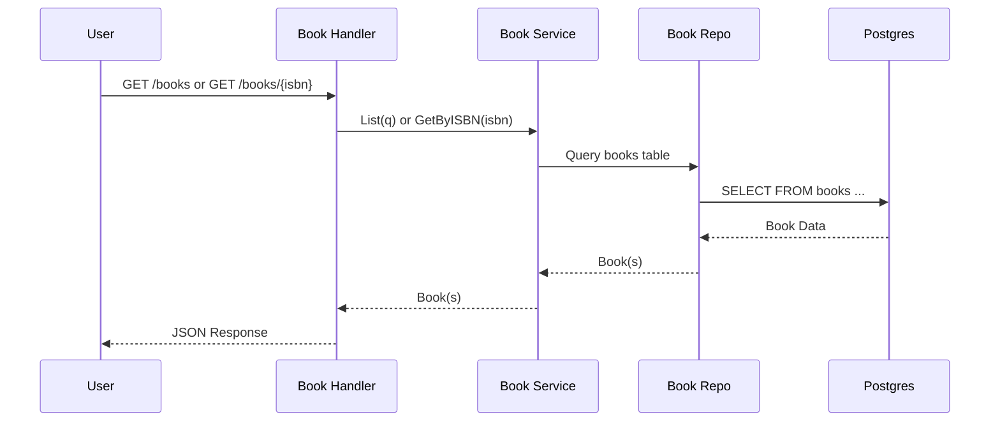

# RFC: Phase 2 - Production Readiness & Open Library Catalog

## Context
The `bookapi` project has successfully implemented its first 5 phases of security hardening and basic authentication. As we move towards a production-ready system and look to provide a richer experience for users, we need to address two major areas:
1. **Production Hygiene & Observability**: Ensuring the system is robust, observable, and follows API best practices.
2. **Book Catalog Integration**: Integrating with Open Library to provide a massive, searchable book database, which will also serve as a learning ground for advanced SQL queries, full-text search, and performance tuning at scale.

## Goals
- Achieve "production-ready" runtime hygiene (graceful shutdown, timeouts, structured config).
- Implement a robust observability baseline (request IDs, access logs, panic recovery).
- Standardize the API contract with versioning (`/v1`) and consistent response envelopes.
- Implement a **Catalog** feature that fetches and caches book metadata from Open Library.
- Build a **Cron Ingestion Job** to populate the local database with realistic book data for learning purposes.

## Non-Goals
- Building a full Administrative UI.
- Implementing a distributed asynchronous job system (like Celery or Temporal) - a simple cron/internal trigger is sufficient for now.
- Full OpenTelemetry tracing (Otel) - logs and basic metrics are the priority.
- Generating client SDKs.

## User Stories
### Reader / API Developer
- As a **Reader**, I want to search for books by title, author, or genre across a large catalog so I can find new books to read.
- As an **API Developer**, I want a consistent API versioning and response format so I can easily integrate with the `bookapi`.
- As a **Reader**, I want to see detailed metadata (page counts, languages, cover images) for books I find.

### Operator / System Developer
- As an **Operator**, I want the server to shut down gracefully so that in-flight requests are not abruptly terminated during deployments.
- As a **Developer**, I want to see a unique Request-ID in every log entry and error response so I can easily trace issues in production.
- As an **Operator**, I want the ingestion job to be idempotent and respect Open Library's rate limits so our service remains a good citizen of the web.

## Architecture

### System Flow: Cron Ingestion with Materialization
The ingestion process discovers books via the Open Library Search API, hydrates detailed metadata via the Books API, stores raw data in `catalog_books`/`catalog_sources` (source-of-truth), and then materializes into the `books` table so `/books` endpoints show ingested data.

**Why keep `catalog_books` separate?**
- Open Library data can be incomplete or inconsistent.
- Keeping upstream data separate allows us to evolve mapping rules (genre defaults, publisher parsing, etc.) without losing provenance.
- `catalog_sources` stores raw JSON for debugging and reprocessing.

```mermaid
flowchart TD
  OpenLibrary[OpenLibraryAPI] --> IngestService

  IngestService -->|upsert_raw| CatalogBooks[(catalog_books)]
  IngestService -->|upsert_raw| CatalogSources[(catalog_sources)]
  IngestService -->|record_run| IngestRuns[(ingest_runs)]

  IngestService -->|materialize_upsert| Books[(books)]

  Books --> BooksList[GET_/books]
  Books --> BookByISBN[GET_/books/{isbn}]

  ReadingListAPI[ReadingListAPI] --> UserBooks[(user_books)]
  UserBooks --> Books

  RatingsAPI[RatingsAPI] --> Ratings[(ratings)]
  Ratings --> Books
```

### Request Flow: Books API (Materialized from Catalog)
Users browse books via `GET /books` and `GET /books/{isbn}`, which query the `books` table. This table is populated by the ingestion job's materialization step, which transforms `catalog_books` data into the app's normalized schema.

**Materialization Rules:**
- `books.genre = <subject>` (the discovery subject used during ingestion, e.g., "fiction", "history", "science")
- `books.publisher = "Unknown"` if missing from Open Library
- ISBN preference: 13-digit when available
- Other fields map directly from `catalog_books` (title, subtitle, description, cover_url, etc.)



### Module Design (Aligned to docs/architecture.md)
We will introduce the following modules:
- `internal/catalog/`: Handles local caching and serving of book metadata.
- `internal/platform/openlibrary/`: A dedicated client for Open Library APIs.
- `internal/ingest/`: Logic for the batch ingestion process.
- `internal/httpx/`: Extensions for request IDs, logging, and recovery middleware.

## Data Model
We will add two primary tables to support the catalog:

### `catalog_books`
Stores normalized book data for fast searching and display.
- `isbn13` (PK)
- `title`, `subtitle`, `description`
- `cover_url`
- `published_date`, `publisher`
- `language`, `page_count`
- `search_vector` (TSVECTOR for FTS)
- `updated_at` (to track cache freshness)

### `catalog_sources`
Stores the raw JSON from providers for future re-processing without re-fetching.
- `isbn13` (PK)
- `provider` (e.g., 'OPEN_LIBRARY')
- `raw_json` (JSONB)
- `fetched_at`

## API Design

### Versioning
All new endpoints will be prefixed with `/v1`. Existing endpoints will eventually be migrated or deprecated.

### Standard Response Envelope
All responses will follow this format:
```json
{
  "success": true,
  "data": { ... },
  "meta": { "request_id": "..." }
}
```

### Endpoints
- `GET /books`: List books with search/filtering (queries the `books` table, populated by ingestion materialization).
- `GET /books/{isbn}`: Get book details by ISBN (queries the `books` table).
- `POST /internal/jobs/ingest`: (Protected) Manually trigger the Open Library ingestion job, which upserts into `catalog_books` and then materializes into `books`.

**Note**: Catalog-specific endpoints (`/v1/catalog/*`) were removed to avoid confusion. The main API is `/books`, which shows ingested data after materialization.

## Open Library Ingestion Spec

### API References
We will use the following Open Library endpoints:
- **Search API**: `https://openlibrary.org/search.json?q={subject}&fields=key,title,author_name,isbn,first_publish_year,language&limit=100`
- **Books API (Data)**: `https://openlibrary.org/api/books?bibkeys=ISBN:{isbn1},ISBN:{isbn2}&jscmd=data&format=json`

### Strategy
1. **Discovery**: Use the Search API to find books by popular subjects (e.g., 'fiction', 'science', 'history').
2. **Hydration**: Collect ISBNs and fetch full details in batches of 50-100 using the Books API.
3. **Storage**: 
   - Upsert into `catalog_books` (source-of-truth for Open Library data).
   - Cache the raw JSON in `catalog_sources` for debugging/reprocessing.
   - **Materialize** into `books` table (app-facing normalized schema) so `/books` endpoints show ingested data.
4. **Rate Limiting**: 
   - Set a descriptive `User-Agent`: `BookAPI/1.0 (contact: your-email@example.com)`.
   - Implement exponential backoff for 429/5xx errors.
   - Limit to 1 request per second to remain a good citizen.
5. **Freshness**: Use an `updated_at` column to ensure we don't re-fetch a book more than once every 7 days unless forced.

### Incremental Ingestion Semantics (100 today → 200 tomorrow)
We will interpret ingestion limits as **desired total unique rows** in our local database (not "fetch this many every run").

- Example behavior:
  - Day 1 config: `INGEST_BOOKS_MAX=100` → ingest until `catalog_books` contains ~100 unique books.
  - Day 2 config: `INGEST_BOOKS_MAX=200` → ingest only the *missing* unique books to reach ~200 total.
- If the configured max decreases, we **do not delete** existing data; it only affects future ingestion runs.

This makes ingestion deterministic for learning purposes while allowing the dataset to grow over time.

### Run History (compare runs / learning SQL)
In addition to the canonical catalog tables, we will record ingestion runs so we can compare runs and analyze ingestion behavior.

- Add tables:
  - `ingest_runs`: one row per run (started_at, finished_at, config snapshot, counters).
  - `ingest_run_books`: join table `(run_id, isbn13)`.
  - `ingest_run_authors`: join table `(run_id, author_key)`.
- Practical uses:
  - Find which books were newly added in the latest run.
  - Compare two runs (what changed, what was skipped due to freshness).
  - Measure ingestion performance over time (duration, error rates).

### Testing Requirements (Cron/Job Ingestion)
We will add unit tests to ensure the ingestion job works reliably and remains safe to run repeatedly.

- Minimum unit test coverage:
  - **Incremental target behavior**: when max increases (100 → 200), only missing unique rows are added.
  - **Dedupe**: repeated ISBNs/author keys do not create duplicates.
  - **Batching**: Books API bibkeys batching logic is correct.
  - **Freshness**: recently fetched records are skipped unless forced.
  - **Run history**: `ingest_runs` and join tables are recorded consistently.

## Security & Observability

### Runtime Hygiene
- **Graceful Shutdown**: Handle `SIGTERM` and `SIGINT` to allow the server to finish processing requests.
- **HTTP Hardening**: Set `ReadHeaderTimeout: 5 * time.Second` and `MaxHeaderBytes: 1 << 20` (1MB).
- **Structured Config**: Move from scattered `os.Getenv` calls to a single `Config` struct with validation.

### Observability
- **Request ID**: Every request gets a UUID in the `X-Request-Id` header, propagated through logs and responses.
- **Access Logs**: Log `method`, `path`, `status`, `duration_ms`, `request_id`, and `user_id`.
- **Panic Recovery**: Catch panics and return a clean JSON 500 error with the `request_id`.

## Epics and Task Breakdown

### Epic 0: Runtime Hygiene & Config
- [ ] Implement `Config` struct and validation in `cmd/api/main.go`.
- [ ] Implement graceful shutdown using `context.WithCancel` and `http.Server.Shutdown`.
- [ ] Configure `ReadHeaderTimeout` and `MaxHeaderBytes` for the HTTP server.

### Epic 1: Observability Baseline
- [ ] Create `httpx.RequestIDMiddleware`.
- [ ] Create `httpx.AccessLogMiddleware`.
- [ ] Create `httpx.RecoveryMiddleware`.
- [ ] Integrate middlewares into `main.go`.

### Epic 2: API Contract & v1
- [ ] Update `httpx.JSONSuccess` and `httpx.JSONError` to include the standard envelope.
- [ ] Wrap all routes in a `/v1` router or prefix.
- [ ] Fix routing bug: Ensure `PATCH /me/profile` is correctly registered.

### Epic 3: Data Layer Hardening
- [ ] Add context timeouts to all `PostgresRepo` methods.
- [ ] Implement `goose` or similar for migration management.
- [ ] Add missing indexes for `users(email)`, `sessions(user_id)`, and `reading_list(user_id)`.

### Epic 4: Catalog & Open Library Client
- [ ] Implement the `openlibrary.Client` with `User-Agent` and timeout settings.
- [ ] Create migrations for `catalog_books` and `catalog_sources`.
- [ ] Implement `catalog.Service` with read-through caching logic.
- [ ] Implement `GET /v1/catalog/books/{isbn}`.

### Epic 5: Ingestion Job (Cron)
- [ ] Create the ingestion job logic (Discovery -> Hydration -> Upsert).
- [ ] Implement batching and rate-limiting/backoff in the ingest service.
- [ ] Add `POST /internal/jobs/ingest` endpoint (protected by internal secret or admin role).

### Epic 6: SQL & Search Learning (Exercises)
- [ ] Populate the DB with 10k+ books from Open Library.
- [ ] Experiment with `EXPLAIN ANALYZE` on complex search queries.
- [ ] Tune PostgreSQL Full-Text Search weights and ranking (`ts_rank`).
- [ ] Compare performance of offset-based vs cursor-based pagination on large datasets.
